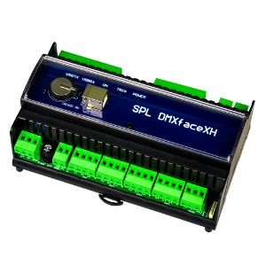

http://www.dmxface.at
# ioBroker.dmxface
Programmable IO Controller with 
 DMX Out
 DMX In
 8 to 16 In- and Outports  (16 ports with the IO8 extension)
 6 LED common anode Ports up to 1A/channel
 IR receiver and transmitter port
 RS485 Bus for the connection of up to 8 LCD touch displays with 2,4 or 8 inches.
 LAN Interface supporting up to 7 individual configurable sockets
 USB Port for programming and communication
Dokumentation and communication protocoll downloads http://www.spl-technik.at/index.php/dmxface-downloads
 
## DMXface adapter for ioBroker
This adapter connects the DMXfaceXP controller with ioBroker.
The communication protocoll used is the DMXface ACTIVE SEND protocoll.

## Developer manual
This IObroker adapter uses the DMXface ACTIVE SEND protocoll to communicate.
To configure the DMXface controller, you need the 'DMXface Console' downloadable at www.dmxface.at.
After connecting by USB you can access and change the controllers setup und network settings as well programm the controller.

DMXface network settings (Menu: DMXface settings / Network setup)
Here you can configure a valid IP address for the DMXface controller.
To get the DMXface connected to the IO Broker you have as well to setup the socket 6 or 7:
Set it to 'TCP SERVER', 'ACTIVE SEND PROTOCOLL' with a valid PORT (Default = 6000).

DMXface setup settings (Menu: DMXface settings / Basic setup)
If you want to receive IO Port changes or IR Remote control data then enable 'LAN SOCKET 6 or 7 sends ACTS messages' and select 
Outport change, Inport change and Infrared receive in the 'Send ACTS message at event' area below.

To receive DMX channel values enable 'LAN SOCKET 6 or 7 sends DMX channel values
Choose the number of DMXchannels that should be transferred to IObroker and the intervall within the channels are sent.
Save the changes, done.

Add the dmxface adapter from github  https://github.com/DMXface/ioBroker.dmxface.git
Create an instance of the adapter.

Adapter configuration:
IP address:  Same as used for the DMXfaceXP controller
Port: Same as configured in the network socket 6 or 7
Last DMX channel used: Number of DMX state objects that will be created when the DMXface adapter ist started.

Request timing: TBD

### 0.0.1
not released 

##  Changelog

## License
MIT License

Copyright (c) 2019 SPaL Oliver Hufnagl <mail@dmxface.at>

Permission is hereby granted, free of charge, to any person obtaining a copy
of this software and associated documentation files (the "Software"), to deal
in the Software without restriction, including without limitation the rights
to use, copy, modify, merge, publish, distribute, sublicense, and/or sell
copies of the Software, and to permit persons to whom the Software is
furnished to do so, subject to the following conditions:

The above copyright notice and this permission notice shall be included in all
copies or substantial portions of the Software.

THE SOFTWARE IS PROVIDED "AS IS", WITHOUT WARRANTY OF ANY KIND, EXPRESS OR
IMPLIED, INCLUDING BUT NOT LIMITED TO THE WARRANTIES OF MERCHANTABILITY,
FITNESS FOR A PARTICULAR PURPOSE AND NONINFRINGEMENT. IN NO EVENT SHALL THE
AUTHORS OR COPYRIGHT HOLDERS BE LIABLE FOR ANY CLAIM, DAMAGES OR OTHER
LIABILITY, WHETHER IN AN ACTION OF CONTRACT, TORT OR OTHERWISE, ARISING FROM,
OUT OF OR IN CONNECTION WITH THE SOFTWARE OR THE USE OR OTHER DEALINGS IN THE
SOFTWARE.